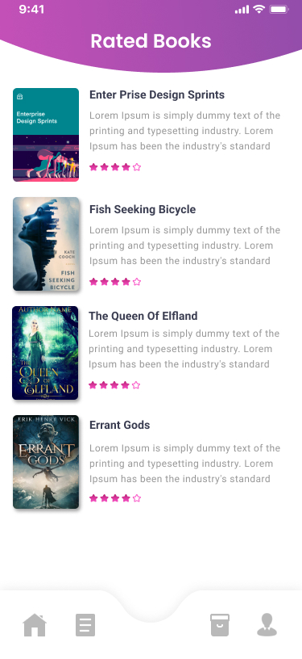
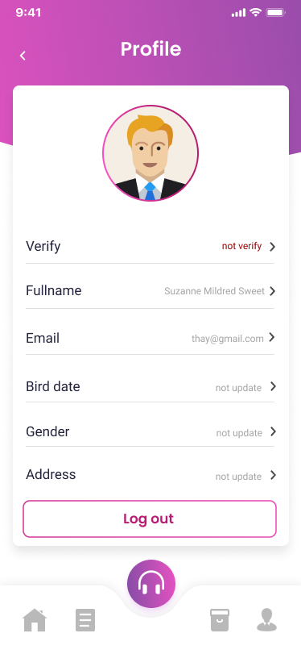

# Book Recommendation App

Welcome to the Book Recommendation App! This is an Android application built using Jetpack Compose and follows the principles of Clean Architecture. The app provides a user-friendly interface for browsing and discovering books, as well as personalized book recommendations based on user preferences.

## Features

- User registration and authentication
- Book search and browsing
- Personalized book recommendations using content-based and collaborative filtering algorithm
- Book details with images, tags, descriptions, ratings
- Bookshelf for managing favorite books

## Technologies Used

- Android Jetpack Compose
- Modern app architecture
- Chaquopy (Python SDK)
- [Book Recommendation Algorithm](https://github.com/kieubaduong/Book-Recommendation-Algorithms)

## Project Structure

BookReadingApp.kt
├── core
├── data
│   ├── model
│   ├── network
│   │   ├── api
│   │   ├── auth
│   │   │   ├── body
│   │   │   └── result
│   └── repository
├── navigation
├── ui
│   ├── MainActivity.kt
│   ├── auth
│   ├── common
│   └── theme
└── util

The project follows the Clean Architecture principles, which separates the codebase into layers:

- `core`: Contains all type of class using across the application.
- `data`: Implements the data access layer + domain layer, including remote data sources, repositories and the business logic.
  - `model`: Contains data class for the ui consume.
  - `body`: Contains data class for the body HTTP request.
  - `result`: Contains data class for the body HTTP result.
- `ui`: Implements the presentation layer, including view models and UI screens.
- `navigation`: Implements the navigation graph.
- `util`: Contains helper method and extensions.

## Screenshots

|                                       |                                        |                                         |
| :-----------------------------------: | :------------------------------------: | :-------------------------------------: |
|             Splash Screen             |                Sign In                 |               Home Screen               |
|    |      |   |
|               Book Detail             |              Rated Books               |                 Saved Books                  |
| |     |  |
|               Profile                         
|        

## Getting Started

### Prerequisites

- Android Studio Arctic Fox (2020.3.1) or higher
- Kotlin 1.5.21 or higher

### Todo

- Dependency injection
